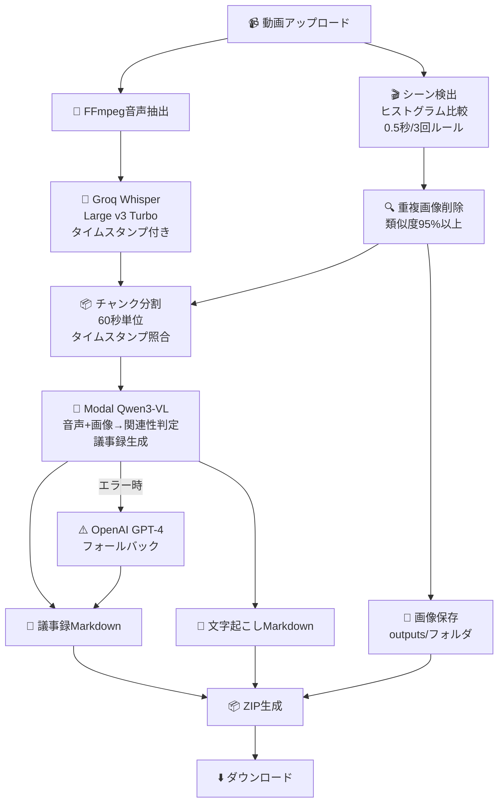

# 議事録エージェント

動画（MP4, MOV, AVIなど）から自動で**議事録**と**文字起こし**の2種類のドキュメントを生成するAIエージェント。

## 📌 概要

このエージェントは、会議やプレゼンテーションの動画から以下を自動生成します：

1. **📄 議事録**: AIが要約・整理した会議記録（関連画像付き）
2. **📝 文字起こし**: タイムスタンプ付き発言録（関連画像付き）
3. **🖼️ キーフレーム画像**: シーン変化を検出して抽出した画像

すべてZIPファイルで一括ダウンロード可能。

### 主な特徴

- ✅ **インテリジェントな画像選択**: 音声内容と時間的・内容的に関連する画像のみを選択
- ✅ **高精度な文字起こし**: Groq Whisper Large v3 Turboでタイムスタンプ付き
- ✅ **マルチモーダルAI**: Qwen3-VLが画像+テキストから議事録を生成
- ✅ **ノイズ除去**: 頻繁なシーン変化や重複画像を自動削除

---

## 機能

### ✅ 実装済み

1. **動画アップロード**
   - 最大500MBまでのMP4/MOV/AVI/MKV/WEBM対応
   - セキュアなファイル保存

2. **Groq Whisper Large v3 Turbo文字起こし**
   - 音声→テキスト変換（タイムスタンプ付き）
   - 日本語対応

3. **インテリジェントなシーン検出**
   - **TransNetV2ディープラーニングモデル**でシーン変化を自動検出 🆕
   - Apple Silicon（M1/M2/M3）MPS GPU対応 ✅
   - OpenCVヒストグラム比較に自動フォールバック
   - 重複画像を自動削除（類似度95%以上）
   - 画像をディスクに保存（`outputs/`フォルダ）

4. **Qwen3-VL (Modal) 統合**
   - マルチモーダルLLMで画像+テキストから議事録生成
   - **音声とタイムスタンプを照合して関連画像のみを選択** ✅
   - 60秒単位でチャンク分割
   - 画像は最大10枚/チャンク
   - エラー時はOpenAI GPT-4にフォールバック

5. **2種類のドキュメント出力** 🆕
   - **議事録** (`minutes_*.md`): LLMで要約・整理された会議記録
   - **文字起こし** (`transcript_*.md`): タイムスタンプ付き発言 + 関連画像
   - 画像ファイル: すべてのキーフレーム（JPG形式）
   - **ZIPダウンロード**: 上記すべてを一括ダウンロード ✅

## 必要なAPIキー

| API | 用途 | 必須? | 取得先 |
|-----|------|-------|--------|
| **GROQ_API_KEY** | 音声文字起こし | ✅ 必須 | https://console.groq.com/ |
| **MODAL_QWEN3VL_ENDPOINT** | 議事録生成（推奨） | ⭕ 推奨 | Modal App URL |
| **OPENAI_API_KEY** | フォールバック | ⚠️ バックアップ | https://platform.openai.com/ |

### `.env` ファイル

```bash
# Groq API Key (Whisper文字起こし用) - 必須
GROQ_API_KEY=gsk_xxxxxxxxxxxxx

# Modal Qwen3-VL Endpoint (画像付き議事録生成用) - 推奨
MODAL_QWEN3VL_ENDPOINT=https://your-modal-app.modal.run

# OpenAI API Key (フォールバック用) - オプション
OPENAI_API_KEY=sk-xxxxxxxxxxxxx
```

## クイックスタート

### 方法1: 自動セットアップ（推奨・5分）

```bash
cd /path/to/meeting-minutes-agent

# 自動セットアップ実行
./quick_setup.sh
```

スクリプトが以下を自動で行います：
- 仮想環境作成
- パッケージインストール
- `.env` ファイル作成（APIキーを入力）
- サーバー起動

### 方法2: 手動セットアップ

#### Step 1: APIキー取得

**Groq API Key（必須）**
1. https://console.groq.com/ にアクセス
2. アカウント作成/ログイン
3. API Keys → Create API Key
4. キーをコピー（`gsk_` で始まる）

**OpenAI API Key（オプション）**
1. https://platform.openai.com/ にアクセス
2. API Keys → Create new secret key
3. キーをコピー（`sk-` で始まる）

#### Step 2: 環境構築

```bash
# 仮想環境作成
python -m venv venv
source venv/bin/activate  # Windows: venv\Scripts\activate

# パッケージインストール
pip install -r requirements.txt

# .env ファイル作成
cat > .env << 'EOF'
GROQ_API_KEY=gsk_あなたのキーをここに
EOF
```

#### Step 3: サーバー起動

```bash
python app.py
```

ブラウザで http://localhost:5001 を開く

---

## 📦 出力ファイル

動画を処理すると、以下のファイルが `outputs/` フォルダに生成されます：

### 1. 議事録 (`minutes_*.md`)

```markdown
# 会議議事録

**日時**: 2025年11月07日 03:02

## サマリー

会議の全体像を300文字程度で要約...

## 議事録内容

### [0秒 - 60秒] プロジェクト概要

プロジェクトの目標と進捗状況について議論しました...

**画像** (15.3秒時点):


**主なポイント**:
- 目標達成率80%
- 次回までのアクションアイテム確認
```

### 2. 文字起こし (`transcript_*.md`)

```markdown
# 文字起こし - video.mp4

**生成日時**: 2025年11月07日 03:02

---

**[0.0秒 - 2.5秒]**

皆さん、本日の議題について説明します。


*画像タイムスタンプ: 0.0秒*

---

**[2.5秒 - 7.8秒]**

このグラフをご覧ください。売上が20%増加しています。


*画像タイムスタンプ: 3.4秒*

---
```

### 3. 画像ファイル

```
outputs/
  ├── 20251107_030214_video_mp4_keyframe_0000.jpg
  ├── 20251107_030214_video_mp4_keyframe_0001.jpg
  ├── 20251107_030214_video_mp4_keyframe_0002.jpg
  └── ...
```

### 4. ZIPダウンロード

「ZIPでダウンロード」ボタンを押すと、以下を含むZIPファイルがダウンロードされます：

- `議事録_*.md`
- `文字起こし_*.md`
- すべてのキーフレーム画像（JPG）

---

## 使い方

1. **動画をアップロード**
   - ドラッグ&ドロップまたはファイル選択
   - MP4/MOV/AVI/MKV/WEBM対応（最大500MB）

2. **処理を実行**
   - 「動画を処理」ボタンをクリック
   - 以下の処理が自動実行されます：
     - ✅ 音声抽出
     - ✅ 文字起こし（Groq Whisper）
     - ✅ キーフレーム抽出
     - ✅ 議事録生成（Qwen3-VL）

3. **結果を確認**
   - **プレビュー**: 議事録の概要を表示
   - **議事録**: LLMで整理された会議記録（Markdown）
   - **文字起こし**: タイムスタンプ付き発言 + 画像（Markdown）
   - **JSON**: 生データ

4. **ダウンロード**
   - 「ZIPでダウンロード」ボタンをクリック
   - 議事録、文字起こし、すべての画像を含むZIPファイルがダウンロードされます

---

## 動作モード

| APIキー設定 | 音声文字起こし | 議事録生成 | 画像活用 | 出力 |
|------------|--------------|-----------|---------|-----|
| `GROQ_API_KEY` のみ | ✅ Groq Whisper | テキストのみ | ❌ | 議事録 + 文字起こし（画像なし） |
| + `MODAL_QWEN3VL_ENDPOINT` | ✅ | **画像+テキスト** | ✅ | 議事録 + 文字起こし + 画像 |
| + `OPENAI_API_KEY` | ✅ | テキストのみ | ❌ | 議事録 + 文字起こし（画像なし） |

**最小構成**: `GROQ_API_KEY` だけで動作します
**推奨構成**: Modal追加で画像付き議事録が生成されます

## Modal Qwen3-VL デプロイ（完全版）

画像付き議事録を生成するには、Modal にQwen3-VLをデプロイします。

### Step 1: Modalインストール

```bash
pip install modal
modal setup
```

https://modal.com/ でアカウント作成（無料枠あり）

### Step 2: デプロイ

```bash
# modal_qwen3vl.py が既に用意されています
modal deploy modal_qwen3vl.py
```

デプロイ完了後、URLが表示されます:

```
✓ Created web function endpoint => https://your-username--qwen3vl-meeting-minutes-endpoint.modal.run
```

### Step 3: 環境変数に設定

表示されたURLを `.env` に追加:

```bash
# .env に追記
echo "MODAL_QWEN3VL_ENDPOINT=https://your-username--qwen3vl-meeting-minutes-endpoint.modal.run" >> .env
```

### Step 4: サーバー再起動

```bash
pkill -f "python app.py"
python app.py
```

これで画像付き議事録が生成されるようになります。

### 💰 コスト目安

| サービス | 無料枠 | 有料プラン |
|---------|--------|-----------|
| **Groq** | 30日間無料 | $0.05/1M tokens |
| **Modal** | $30/月無料クレジット | GPU時間で課金 (A100: ~$3/hr) |
| **OpenAI** | $5無料クレジット | GPT-4: $0.03/1K tokens |

**推奨**: まずGroq APIだけで試す → 満足したらModalを追加

## アーキテクチャ



## 処理フロー詳細

### 1. シーン検出

**TransNetV2ディープラーニングモデル使用（優先）** 🆕
- 動画フレームを27x48にリサイズ
- TransNetV2モデルでシーン境界を予測
- トレーニング済み重みを使用（利用できない場合はランダム初期化）
- Apple Silicon MPS GPU対応

**OpenCVヒストグラム比較（フォールバック）**
- ヒストグラム相関係数で前フレームと比較
- 相関係数 < 0.7 → シーン変化と判定
- **0.5秒以内に3回以上変化 → スキップ**（ノイズ除去）
- Base64エンコードで画像保存

### 2. 重複削除

- 直前3フレームとヒストグラム比較
- 類似度 > 95% → 重複として削除
- 効率化のため全フレーム比較はしない

### 3. 画像保存

- キーフレームをディスクに保存（`outputs/` フォルダ）
- ファイル名形式: `{video_id}_keyframe_{index:04d}.jpg`
- Base64からJPEGにデコード

### 4. チャンク分割

- 60秒ごとに分割
- 各チャンク:
  - 音声セグメント（Groq Whisper出力、タイムスタンプ付き）
  - キーフレーム（最大10枚、タイムスタンプ付き）
- 時間軸でマッチング

### 5. Qwen3-VL処理（関連性判定）

各チャンクをModalに送信する際、以下の情報を含む：

```
音声文字起こし（タイムスタンプ付き）:
[5.2秒-12.3秒] このグラフを見てください
[12.5秒-18.7秒] 次の資料をご覧ください

画像情報:
画像0: 7.8秒時点
画像1: 15.2秒時点
画像2: 45.3秒時点
```

Qwen3-VLが以下の基準で関連画像を選択：

1. **時間的一致**: 画像タイムスタンプが音声セグメント時間範囲内（±3秒）
2. **内容的一致**: 音声で言及されている内容が画像に映っている
3. **文脈的価値**: 画像が議論の理解に役立つ

除外される画像：
- 単なる話者の顔や会議室の風景
- 音声内容と無関係
- 情報価値が低い

JSON形式でレスポンス:
```json
{
  "section_title": "セクションタイトル",
  "content": "要約",
  "key_points": ["ポイント1", "ポイント2"],
  "related_images": [0, 1]  // 関連がある画像のインデックスのみ
}
```

### 6. ドキュメント生成

**議事録** (`minutes_*.md`):
- LLMが要約・整理
- セクションごとに関連画像を埋め込み
- キーポイント箇条書き
- アクションアイテム抽出

**文字起こし** (`transcript_*.md`):
- 音声セグメントごとにタイムスタンプ付きで出力
- 各セグメントに±3秒以内の画像を関連付け（最大2枚）
- 画像にタイムスタンプを表示

### 7. ZIPダウンロード

- メモリ上でZIPファイルを生成
- 議事録、文字起こし、すべての画像を含む
- ダウンロード完了後もサーバーに保存（履歴表示用）

## トラブルシューティング

### セットアップ関連

**TransNetV2初期化エラー**
```
❌ TransNetV2モデル初期化エラー
```
→ PyTorchとtorchvisionが正しくインストールされているか確認
→ Apple Siliconの場合はMPSが自動的に使用されます

**Modal デプロイエラー**
```
Error: No Modal token found
```
→ `modal setup` を実行してログインしてください

**仮想環境エラー**
```
python: command not found
```
→ `python3` を使ってください: `python3 -m venv venv`

### API関連

**Groq API エラー**
```
⚠️ Groq APIキーがないか音声ファイルが見つかりません
```
→ `.env` の `GROQ_API_KEY` を確認してください
→ キーが `gsk_` で始まっているか確認

**Modal API エラー**
```
⚠️ MODAL_QWEN3VL_ENDPOINT が設定されていません
```
→ Modal Appをデプロイして `.env` に `MODAL_QWEN3VL_ENDPOINT` を設定
→ 設定しない場合は自動的にOpenAI GPT-4にフォールバック

**OpenAI API レート制限**
```
❌ OpenAI API エラー: 429
```
→ レート制限に達しています。しばらく待ってから再試行してください

### 処理関連

**シーン検出が多すぎる**

`app.py` の `threshold` パラメータを調整:

```python
keyframes = detect_scene_changes(video_path, threshold=40.0)  # より厳しく（デフォルト: 30.0）
```

**動画が処理されない**

- ファイル形式を確認（MP4, MOV, AVI, MKV, WEBM のみ対応）
- ファイルサイズを確認（500MB以下）
- コンソールログを確認: `cat /tmp/flask_dual_output.log`

**画像が保存されない**

```bash
# outputsフォルダの確認
ls -la outputs/

# 権限エラーの場合
chmod 755 outputs/
```

**文字起こしに画像が表示されない**

- Markdownビューアーで画像パスが相対パスになっているか確認
- ZIPを展開後、議事録・文字起こし・画像を**同じフォルダ**に配置

**ZIPダウンロードが失敗する**

```
❌ ZIPダウンロードエラー: ...
```

→ ブラウザのコンソールログを確認
→ サーバーログを確認: `cat /tmp/flask_dual_output.log`
→ `outputs/` フォルダの権限を確認

**議事録に無関係な画像が多い**

Qwen3-VLのプロンプトがより厳格になるよう `app.py` を調整:

```python
# 関連性のしきい値を変更
related_keyframes = [
    kf for kf in keyframes
    if abs(kf.get('timestamp', 0) - start_time) <= 2.0  # ±3秒 → ±2秒
]
```

## ライセンス

MIT
