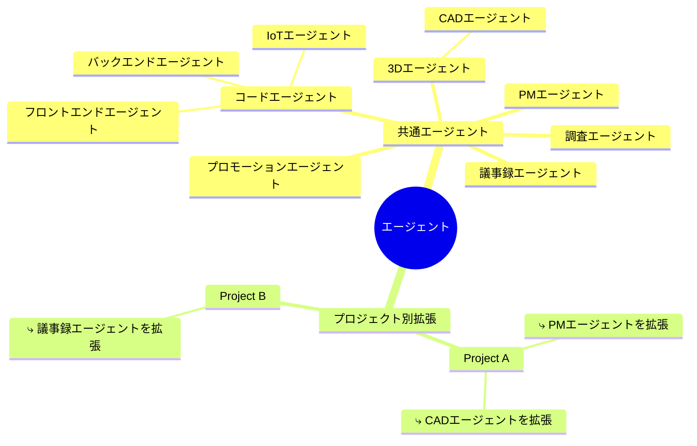
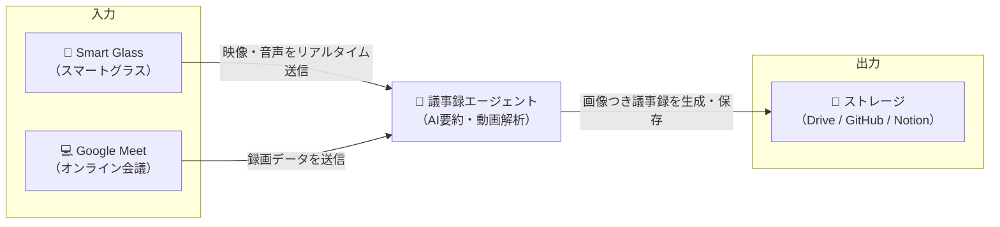
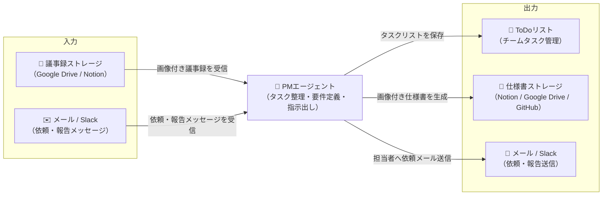
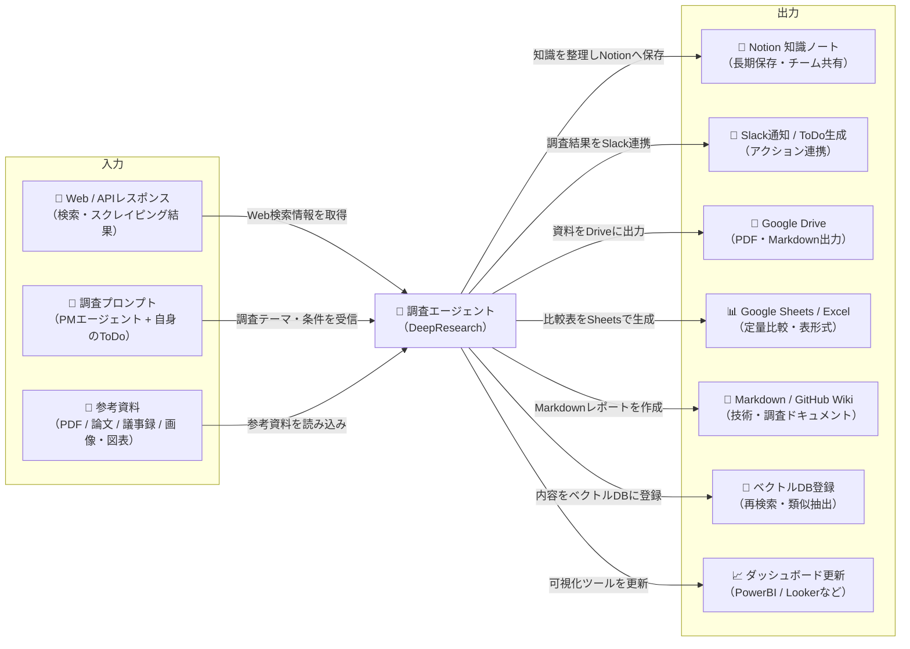
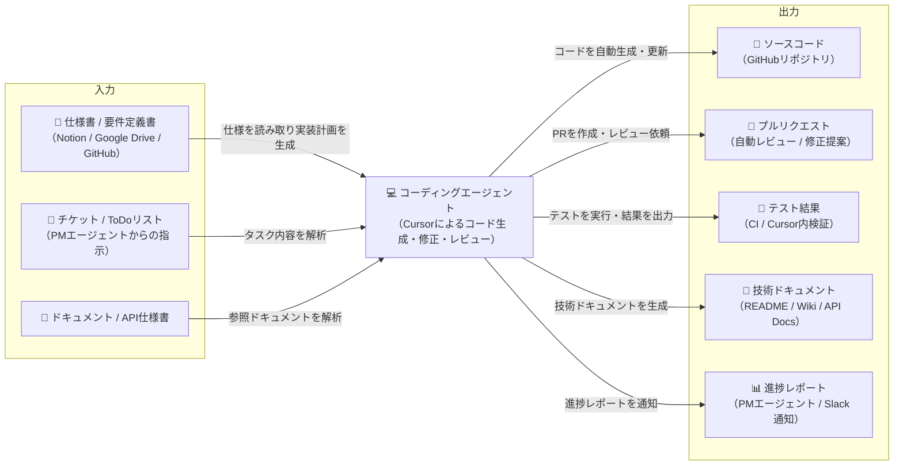

# エージェント

- エージェントは、画像とテキストのルールを参考に入出力を行う
- 入出力はエージェントによって変えられる

## 議事録エージェント

### 実現方法

**オンライン（Google Meet）**:
- Google Meet録画 → Google Drive保存 → Webhook検知
- 並列処理: Google Docs議事録取得 + 動画からスクリーンショット抽出
- スクリーンショット抽出: PySceneDetect（シーン検出） → DeepSeek OCR（テキスト抽出） → Vision API（図表検出） → LLM（重要度スコアリング）
- 統合: 議事録 + スクリーンショット → GitHub保存（`{TargetDir}/Docs/Doc-{MeetingID}-{DateTime}.md`）

**対面（Mentra Glass/ioデバイス）**:
- デバイス → Modal GPU Serverへリアルタイムストリーム送信（音声・映像）
- 並列リアルタイム処理: Whisper API（音声認識） + リアルタイムシーン検出 → DeepSeek OCR → Vision API → LLM
- 統合: 音声テキスト + 重要フレーム → GitHub保存（即座）

## PMエージェント

## 調査エージェント

### 定期的に調査

- 「figure03, 1x, tesla optimusのような人型ロボットをゼロから作りたいので、figure03, 1x, tesla optimusから出ている情報から必要なハードウェアやソフトウェアのコンポーネントを見つけてきて。」
    - この目的を達成するために、必要な情報（気づき）を議事録（Smartglasses, web会議）から引っ張ってきてもらい、それを検索プロンプトに自動で入れられるように、かつそのプロンプトをWebサイトなどで可視化できるようにする

### 一時的に調査

- PMエージェントから出てきたタスクリストに応じて、調査をする

## コーディングエージェント

### 実現方法

- GitHub Webhookで議事録更新検知 → 処理履歴DB確認（未処理のみ処理）
- **Cursor Agent Background API**でコード生成/更新
  - 初回: 新規セッション作成 → コード生成 → セッションID保存
  - 2回目以降: セッションID再利用 → 既存コード更新（連続的に改善）
- scope別制御（`frontend/`、`backend/`、`test/`）→ GitHub PR自動作成